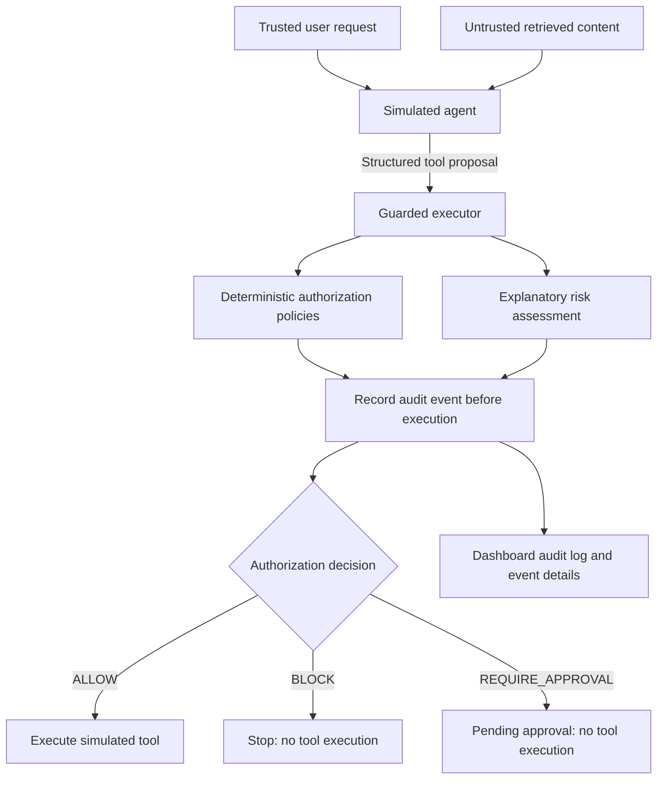

# AgentGate

**Zero-trust runtime security at the agent–tool boundary.**

AgentGate sits between an autonomous agent and its tools. The agent proposes an action; deterministic policies decide whether it may execute, must be blocked, or requires human approval. Each evaluation produces an audit event and an explainable risk score.

**[Open the live demo](https://agentgate.redstone-93593ef8.germanywestcentral.azurecontainerapps.io)** · [Live API documentation](https://agentgate.redstone-93593ef8.germanywestcentral.azurecontainerapps.io/docs)

Agents can consume untrusted documents while holding powerful tool access. A retrieved document might instruct an agent to export customer records instead of answering a support question. AgentGate enforces authorization on the resulting tool proposal: it does not depend on perfectly identifying the malicious text first.

The demo makes that distinction concrete: a manipulated agent's proposal to access **5,000 sensitive records for an external destination is blocked**, while an allowlisted deletion with a **LOW risk score still requires approval**.

> This is a deployed hackathon demonstration. The agent and tools are deterministic simulations: no real LLM, customer database, or email service is connected.

## Try the three scenarios

Open the live dashboard, confirm **API connected**, and run each scenario. Inspect the timeline, then select **View audit event** to see the decision and its explanation.

| Dashboard scenario | Proposed action | Risk | Decision | Actual simulated execution |
| --- | --- | --- | --- | --- |
| **Normal workflow** | Look up order 4821, then email its tracking information | 0/100 · LOW for each call | `ALLOW` | Both fake tools execute; `SUCCESS` |
| **Prompt injection** | Read 5,000 sensitive customer records for an external destination | 80/100 · CRITICAL | `BLOCK` | Database tool never executes; `ATTACK_BLOCKED` |
| **Human approval** | Delete order 4821 using an allowlisted action | 25/100 · LOW | `REQUIRE_APPROVAL` | Deletion does not execute; `APPROVAL_REQUIRED` |

The approval scenario pauses at the decision. There is currently no approve/resume workflow.

## How the boundary works



The simulator receives a guarded executor rather than direct tool adapters. Every proposed action passes through evaluation and audit recording before the executor can invoke a tool. If recording the event fails, the tool is not invoked.

### Policy authorizes; risk explains

- **`ALLOW`** permits the guarded executor to invoke the tool.
- **`BLOCK`** prevents invocation when a blocking policy matches.
- **`REQUIRE_APPROVAL`** withholds execution for actions that need approval.

Decision precedence is **BLOCK → REQUIRE_APPROVAL → ALLOW**. Authorization checks agent/permission identity consistency, tool and action allowlists, sensitive-data volume and destination, destructive actions, and explicitly allowlisted unknown actions. Unknown agents receive no grants.

Risk is calculated independently: sensitive data adds 25 points, an external destination 25, more than 100 records 30, a destructive action 25, a disallowed action or tool 40 each, and an unrecognized action 20. The total is capped at 100. Severity bands are LOW (0–29), MEDIUM (30–59), HIGH (60–79), and CRITICAL (80–100).

**No risk-score threshold grants authorization.** The permitted deletion scores only 25, but `destructive_action_requires_approval` still stops automatic execution. See the [policy implementation](backend/app/policies.py) and [risk model](backend/app/risk.py).

### What happens in the injection attack

1. A trusted user asks for help with an order.
2. An untrusted retrieved document claims to override that task.
3. The scripted agent follows the injected instruction and proposes `customer_database.read` for 5,000 sensitive records with destination `external`.
4. `bulk_sensitive_data_export` and `external_sensitive_data_transfer` both trigger. The bulk policy applies to sensitive access above 100 records, including a `read` action.
5. AgentGate records **BLOCK / 80 / CRITICAL**. The executor returns without invoking the database adapter.

The dangerous proposal is blocked before data is read; no export or email occurs. This demonstrates enforcement after simulated agent manipulation, not a general-purpose prompt-injection detector.

## Auditability

Events include a unique ID, UTC timestamp, agent, tool, action, resource, record count, destination, sensitivity flag, decision, risk score, severity, triggered policies, and explanation. The API returns events newest first and supports combined agent, decision, and severity filters.

The dashboard shows API-derived metrics, an audit feed, event details, and scenario timelines that distinguish trusted input from untrusted content. **An authorization event is not proof of execution**: actual simulated execution is reported separately in the scenario result.

Storage is thread-safe but **process-local and in-memory**. Restarting or replacing the process clears the log; replicas do not share events.

## Stack and production deployment

| Layer | Implementation |
| --- | --- |
| Dashboard | React, TypeScript, Vite, Lucide icons |
| API and security engine | Python, FastAPI, Pydantic; deterministic policies and risk scoring |
| Tests | pytest, HTTPX, Vitest, Testing Library |
| Packaging | Multi-stage Docker build; Node 22 build stage, Python 3.12 runtime |
| Hosting | Azure Container Registry and Azure Container Apps |
| Automation | GitHub Actions CI and CD; Azure OIDC authentication |

The React production build and FastAPI API are served from **one container and one origin**, publicly over HTTPS through Azure Container Apps. The runtime image runs as non-root UID/GID `10001`, exposes port 8000, and checks `/api/health` for container health.

Images reside in a **private Azure Container Registry**. The Container App uses a **user-assigned managed identity with `AcrPull`** to retrieve them. Production currently uses a **single replica** because audit storage is in memory; this does not make the log persistent.

### GitHub Actions CI/CD

[AgentGate CI](.github/workflows/ci.yml) runs on pushes to `main` and pull requests targeting `main`, using Ubuntu 24.04 runners:

1. **Backend tests:** Python 3.12; install `./backend[test]`, then run `python -m pytest -q backend/tests`.
2. **Frontend tests and production build:** Node 22; run `npm ci`, `npm test`, and `npm run build` in `frontend/`. The build includes TypeScript checking.
3. **Production Docker image build:** after both validation jobs succeed, build the root Dockerfile with `docker build --file Dockerfile --tag agentgate:ci .`. CI does not publish the image.

[Deploy AgentGate to Azure](.github/workflows/deploy.yml) runs after successful CI on `main`. It checks out the **exact commit tested by CI**, signs into Azure through **OIDC**, builds a **`linux/amd64` image tagged with that full commit SHA**, pushes it to private ACR, and updates the Container App. It then checks the public `/api/health` endpoint with retries.

GitHub's deployment identity and the Container App's image-pull identity have separate roles. OIDC avoids a long-lived Azure password in GitHub. Both hosted workflows have successfully completed for the deployed application.

## Local development

Requires **Python 3.12+**, **Node.js 22.12+**, and npm. From the repository root:

```sh
python3.12 -m venv backend/.venv
backend/.venv/bin/python -m pip install -e './backend[test]'
npm --prefix frontend ci
```

Start the backend in one terminal:

```sh
cd backend
.venv/bin/python -m uvicorn app.main:app --reload
```

Start the dashboard in another:

```sh
cd frontend
npm run dev
```

Open [the local dashboard](http://localhost:5173) and [local API docs](http://127.0.0.1:8000/docs). Use `localhost:5173` for the dashboard: it matches the backend's explicit development CORS allowlist.

Vite development defaults to the API at `http://127.0.0.1:8000`; production builds default to same-origin requests. Optional `VITE_API_BASE_URL` in `frontend/.env.local` overrides that address. It is public build-time configuration, so do not put secrets there.

## Run with Docker

Docker builds the frontend and packages its output with the backend. Node and frontend build dependencies are excluded from the final Python runtime image.

From the repository root, with port 8000 free:

```sh
docker build -t agentgate:local .
docker run --rm --name agentgate-local -p 127.0.0.1:8000:8000 agentgate:local
```

Open [the container dashboard](http://localhost:8000). From another terminal, check health, run the scenarios, and inspect their audit events:

```sh
curl -fsS http://localhost:8000/api/health
curl -fsS -X POST http://localhost:8000/api/scenarios/normal-support/run
curl -fsS -X POST http://localhost:8000/api/scenarios/prompt-injection/run
curl -fsS -X POST http://localhost:8000/api/scenarios/destructive-approval/run
curl -fsS http://localhost:8000/api/events
```

Stop and automatically remove the temporary container:

```sh
docker stop agentgate-local
```

For an amd64 target when building on an ARM machine, add `--platform linux/amd64` to `docker build`. Keep a single backend worker while using the current in-memory store.

## API overview

| Method | Endpoint | Purpose |
| --- | --- | --- |
| GET | `/api/health` | Service health |
| POST | `/api/evaluate` | Evaluate and audit a structured tool request; does **not** execute a tool |
| GET | `/api/events` | List audit events; optional `agent_id`, `decision`, `severity` filters |
| GET | `/api/events/{event_id}` | Retrieve one audit event |
| GET | `/api/scenarios` | List the three deterministic scenarios |
| POST | `/api/scenarios/{scenario_id}/run` | Run a scenario through the guarded executor; return its timeline and execution results |
| GET | `/docs` | Interactive API documentation |
| GET | `/openapi.json` | OpenAPI schema |

A valid evaluation returning `BLOCK` is an HTTP 200 result. Invalid request bodies are rejected with HTTP 422 before evaluation and do not create audit events. See the [backend documentation](backend/README.md) for request examples and engine details.

## Testing and verification

Run the backend suite from the repository root:

```sh
backend/.venv/bin/python -m pytest -q backend/tests
```

Run frontend tests and the production/typecheck build:

```sh
cd frontend
npm test
npm run build
```

Backend tests cover policy precedence, risk boundaries, validation, audit storage, guarded execution, audit-write failure, API behavior, and production static-file serving. Frontend tests cover API handling, metrics and filters, scenario outcomes, and audit-log refreshes.

The production Docker image has also been built and run locally: health, same-origin dashboard/API, non-root execution, all three security scenarios, and audit events were verified. Hosted CI validates tests and builds; CD checks public health after deployment. The CD health check does not rerun the security scenarios.

## Security and design limitations

- **Simulated integrations:** scenarios use scripted agents and fake tools, with no real LLM, database access, or email delivery.
- **Unauthenticated demo API:** the deployment does not authenticate callers or establish real agent identities. Permission identity checks are not an authentication system.
- **Metadata-based enforcement:** policies rely on supplied sensitivity, record count, and destination fields. The current engine does not inspect data or infer destinations; `external` is an explicit destination value.
- **Guarded path required:** enforcement applies to calls routed through the executor. It is not an operating-system sandbox and cannot prevent tools being invoked outside that path.
- **Ephemeral audit trail:** events are neither durable nor shared across replicas, and no tamper-evident storage is implemented.
- **Limited authorization model:** tool/action allowlists are not resource-level permissions. Approval decisions stop execution but do not provide reviewer authentication, approval, or resumption.

## Future work

- Persistent audit storage with retention and shared access across replicas.
- Authenticated agent identities and real agent/tool integrations that enforce the guarded execution path.
- Reviewer authorization and approval/resume workflows.
- Resource-level permissions, destination controls, and independently verified action metadata.
